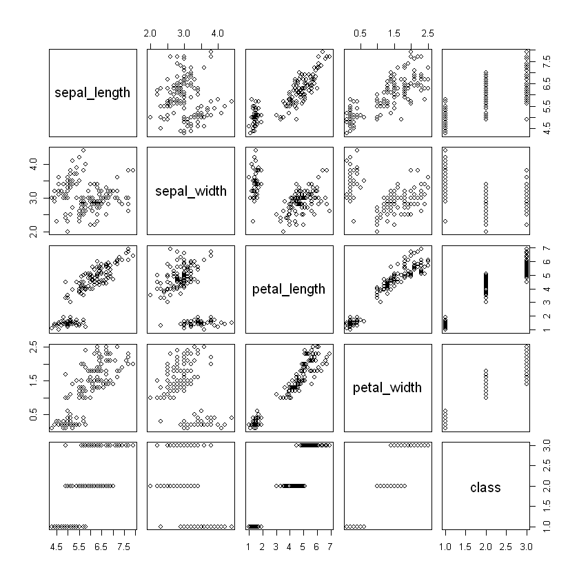
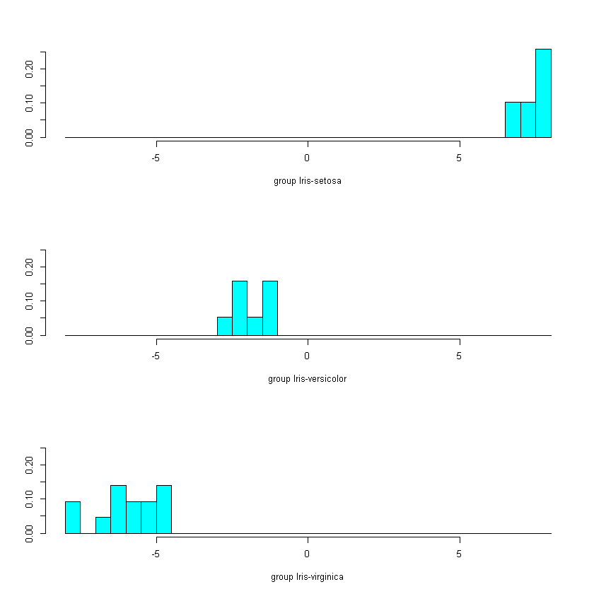
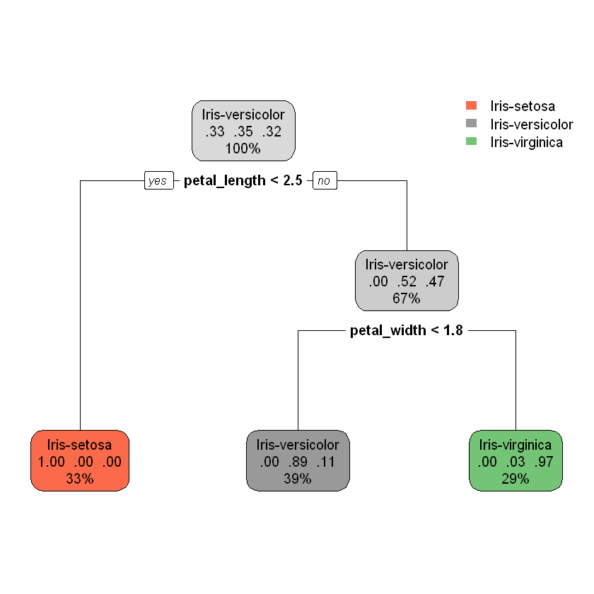
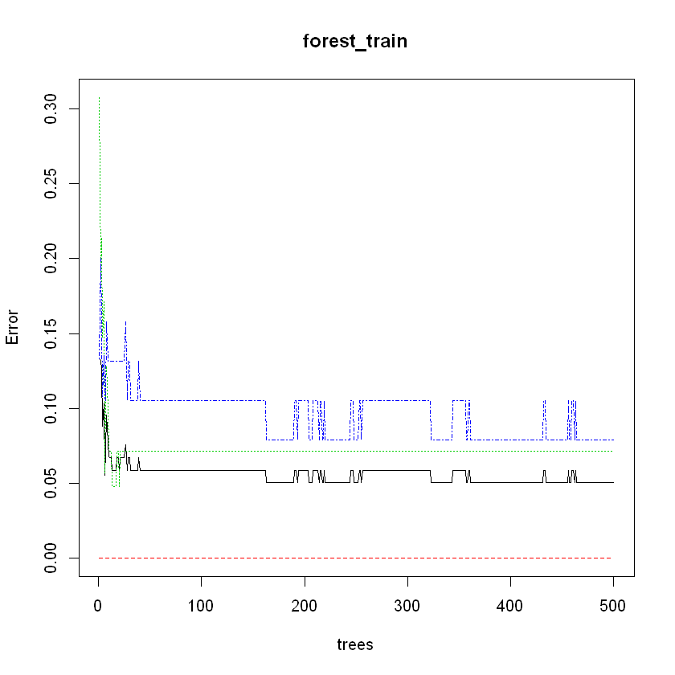

# Running Various Classification Algortihms on the Iris Dataset

This is a first attempt running some basic classification algortihms on the Iris dataset.

## Preprocessing


```R
# Reading in iris dataset
df <- read.csv("C:/Users/Tony Joe/UCI Machine Learning/Data/iris.data.txt")
# Naming columns
names(df) <- c("sepal_length", "sepal_width", "petal_length", "petal_width", "class")
# Printing a couple rows from the top of the dataset
head(df)
# Separating our dataset into a training and test set
train_rows <- sample(nrow(df),size = .8*nrow(df))
train <- df[train_rows,]
test <- df[-train_rows,]
```


<table>
<thead><tr><th scope=col>sepal_length</th><th scope=col>sepal_width</th><th scope=col>petal_length</th><th scope=col>petal_width</th><th scope=col>class</th></tr></thead>
<tbody>
	<tr><td>4.9        </td><td>3.0        </td><td>1.4        </td><td>0.2        </td><td>Iris-setosa</td></tr>
	<tr><td>4.7        </td><td>3.2        </td><td>1.3        </td><td>0.2        </td><td>Iris-setosa</td></tr>
	<tr><td>4.6        </td><td>3.1        </td><td>1.5        </td><td>0.2        </td><td>Iris-setosa</td></tr>
	<tr><td>5.0        </td><td>3.6        </td><td>1.4        </td><td>0.2        </td><td>Iris-setosa</td></tr>
	<tr><td>5.4        </td><td>3.9        </td><td>1.7        </td><td>0.4        </td><td>Iris-setosa</td></tr>
	<tr><td>4.6        </td><td>3.4        </td><td>1.4        </td><td>0.3        </td><td>Iris-setosa</td></tr>
</tbody>
</table>


```R
summary(df)
```


      sepal_length    sepal_width     petal_length    petal_width   
     Min.   :4.300   Min.   :2.000   Min.   :1.000   Min.   :0.100  
     1st Qu.:5.100   1st Qu.:2.800   1st Qu.:1.600   1st Qu.:0.300  
     Median :5.800   Median :3.000   Median :4.400   Median :1.300  
     Mean   :5.848   Mean   :3.051   Mean   :3.774   Mean   :1.205  
     3rd Qu.:6.400   3rd Qu.:3.300   3rd Qu.:5.100   3rd Qu.:1.800  
     Max.   :7.900   Max.   :4.400   Max.   :6.900   Max.   :2.500  
                 class   
     Iris-setosa    :49  
     Iris-versicolor:50  
     Iris-virginica :50  
                         
                         
                         


## R Libraries


```R
library(MASS) # Contains functions to perform linear discriminant analysis
library(rpart) # Contains functions to perform decision trees (and random forest [?]) 
library(rpart.plot) # Plot our decision tree
library(randomForest) # Functions to generate a random forest
```

    randomForest 4.6-14
    Type rfNews() to see new features/changes/bug fixes.
    

## Analysis

### Exploratory


```R
plot(df)
```





### Linear Discriminant Analysis


```R
lda_train <- lda(class ~ ., df)
lda_train
```


    Call:
    lda(class ~ ., data = df)
    
    Prior probabilities of groups:
        Iris-setosa Iris-versicolor  Iris-virginica 
          0.3288591       0.3355705       0.3355705 
    
    Group means:
                    sepal_length sepal_width petal_length petal_width
    Iris-setosa         5.004082    3.416327     1.465306    0.244898
    Iris-versicolor     5.936000    2.770000     4.260000    1.326000
    Iris-virginica      6.588000    2.974000     5.552000    2.026000
    
    Coefficients of linear discriminants:
                        LD1         LD2
    sepal_length  0.8180833 -0.03046124
    sepal_width   1.5432537 -2.14870484
    petal_length -2.1790590  0.92815870
    petal_width  -2.8475754 -2.79709076
    
    Proportion of trace:
       LD1    LD2 
    0.9914 0.0086 


```R
lda_pred <- predict(object = lda_train, newdata = test )
```


```R
table(lda_pred$class,test$class)
```


                     
                      Iris-setosa Iris-versicolor Iris-virginica
      Iris-setosa               9               0              0
      Iris-versicolor           0               8              0
      Iris-virginica            0               0             13


### Quadratic Discriminant Analysis


```R
qda_train <- qda(class~., train)
qda_train
```


    Call:
    qda(class ~ ., data = train)
    
    Prior probabilities of groups:
        Iris-setosa Iris-versicolor  Iris-virginica 
          0.3277311       0.3529412       0.3193277 
    
    Group means:
                    sepal_length sepal_width petal_length petal_width
    Iris-setosa         5.043590    3.433333     1.484615   0.2410256
    Iris-versicolor     5.938095    2.766667     4.247619   1.3190476
    Iris-virginica      6.521053    2.944737     5.494737   2.0000000


```R
qda_pred <- predict(qda_train, test)
```


```R
table(qda_pred$class,test$class)
```


                     
                      Iris-setosa Iris-versicolor Iris-virginica
      Iris-setosa              10               0              0
      Iris-versicolor           0               8              0
      Iris-virginica            0               0             12


### Plotting LDA and QDA projections


```R
ldahist(lda_pred$x, g = lda_pred$class)
```





### Decision Tree


```R
tree_train <- rpart(formula = class~., data = train)
rpart.plot(tree_train)
```





```R
tree_pred <- predict(tree_train, test, type = "class")
table(tree_pred, test$class)
```


                     
    tree_pred         Iris-setosa Iris-versicolor Iris-virginica
      Iris-setosa              10               0              0
      Iris-versicolor           0               8              0
      Iris-virginica            0               0             12


### Random Forest 


```R
forest_train <- randomForest(class~., data = train)
forest_train
```


    
    Call:
     randomForest(formula = class ~ ., data = train) 
                   Type of random forest: classification
                         Number of trees: 500
    No. of variables tried at each split: 2
    
            OOB estimate of  error rate: 5.04%
    Confusion matrix:
                    Iris-setosa Iris-versicolor Iris-virginica class.error
    Iris-setosa              39               0              0  0.00000000
    Iris-versicolor           0              39              3  0.07142857
    Iris-virginica            0               3             35  0.07894737


```R
forest_pred <- predict(forest_train, test, type = "response")
table(forest_pred,test$class)
```


                     
    forest_pred       Iris-setosa Iris-versicolor Iris-virginica
      Iris-setosa              10               0              0
      Iris-versicolor           0               8              0
      Iris-virginica            0               0             12


```R
plot(forest_train)
```




